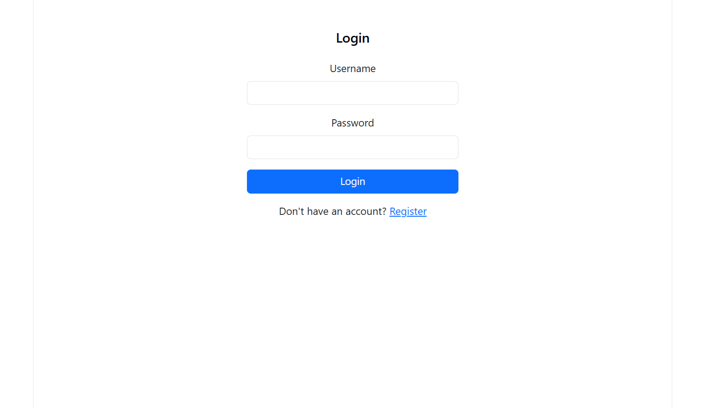
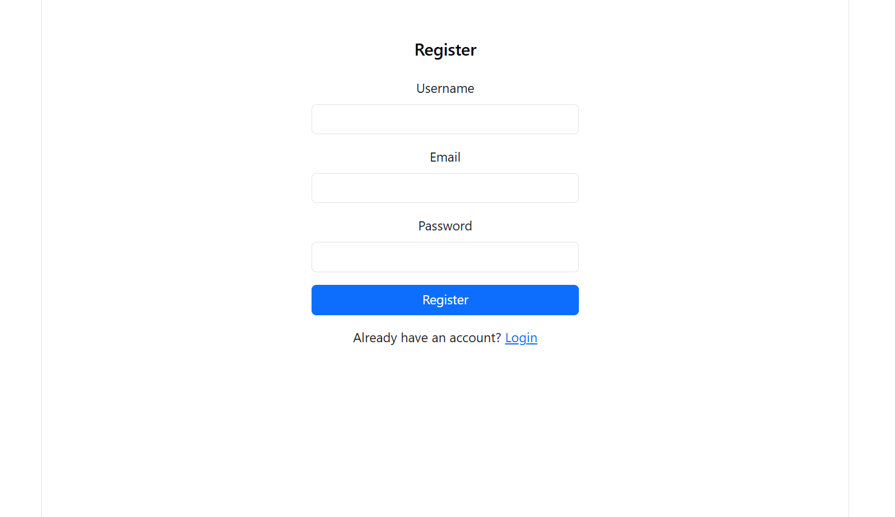
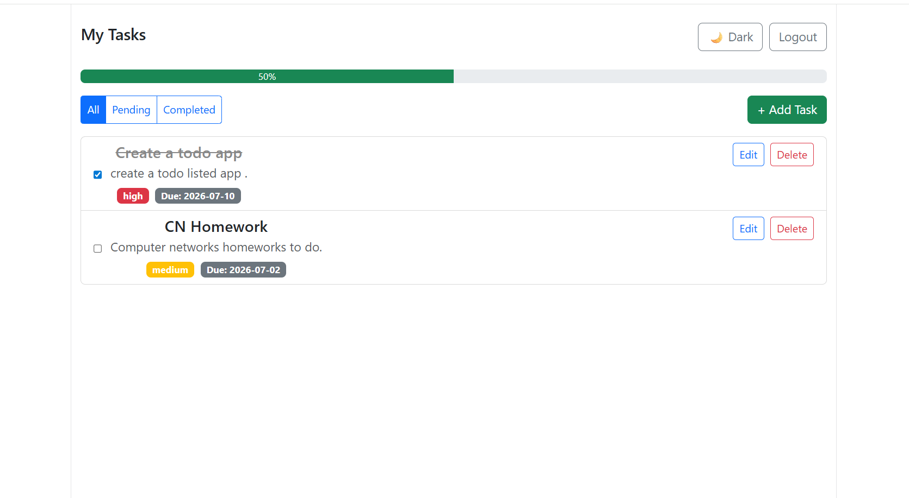
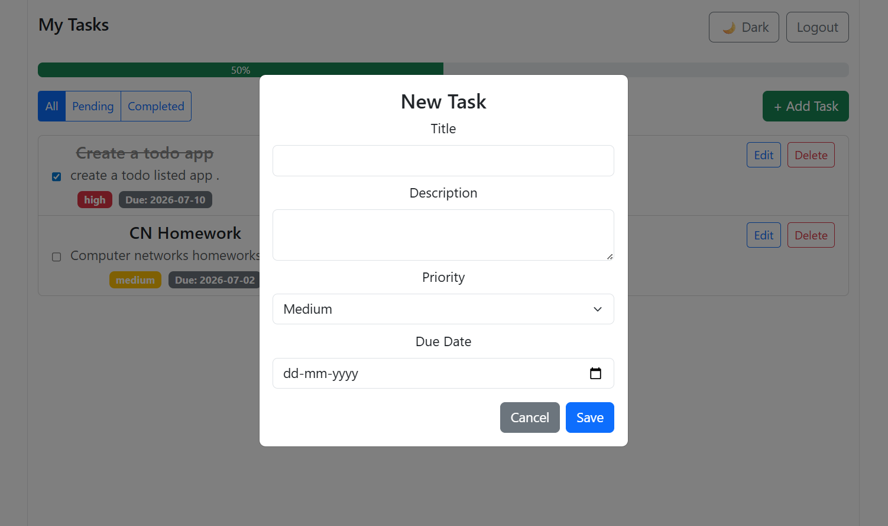
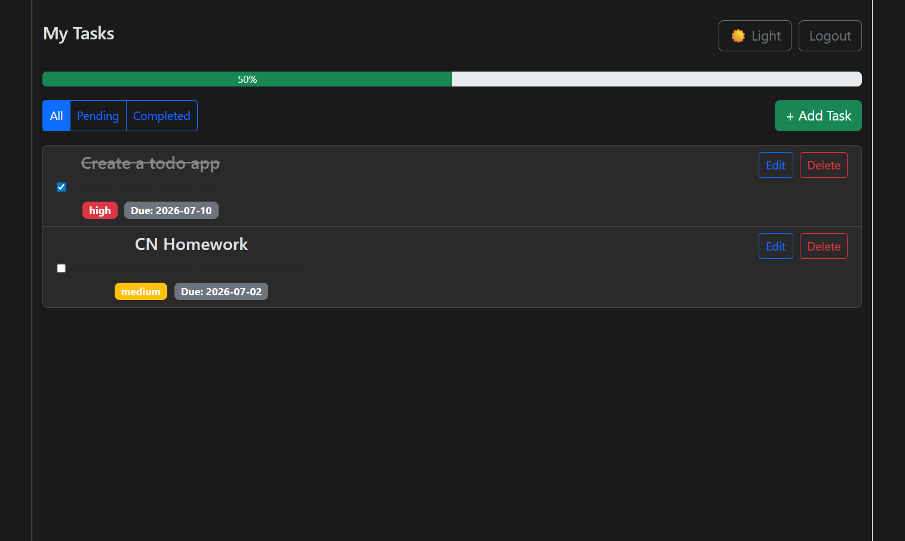

# Task Manager App

A full-stack task management application built with Django REST Framework and React.

## Tech Stack

**Backend:**
- Python, Django, Django REST Framework
- SimpleJWT for JWT authentication
- SQLite database
- django-environ, django-cors-headers

**Frontend:**
- React (Vite)
- React Router
- Axios
- Bootstrap 5

## Features

- User registration and login with JWT authentication
- Add, edit, delete, and mark tasks as complete
- Filter tasks by All / Pending / Completed
- Tasks are private to each logged-in user
- Priority levels (Low, Medium, High) and due dates
- Completion percentage progress bar
- Dark / Light mode toggle
- Auto token refresh on expiry
- Error handling on frontend and backend

## Project Structure

task-manager-app/
├── backend/         # Django REST Framework API
│   ├── config/      # Django project settings and URLs
│   ├── tasks/       # Tasks app (models, views, serializers, URLs)
│   ├── manage.py
│   └── requirements.txt
├── frontend/        # React (Vite) frontend
│   ├── src/
│   │   ├── api/         # Axios instance with JWT handling
│   │   ├── context/     # AuthContext for global auth state
│   │   ├── components/  # TaskItem, TaskForm, ProtectedRoute
│   │   └── pages/       # Login, Register, Dashboard
│   └── package.json
├── screenshots/     # App screenshots
└── README.md

## Setup Instructions

### Prerequisites
- Python 3.10+
- Node.js 18+

### Backend Setup

```bash
cd backend
python -m venv env1
env1\Scripts\activate        # Windows
# source env1/bin/activate   # Mac/Linux

pip install -r requirements.txt
```

Create a `.env` file inside `backend/`:

SECRET_KEY=t%ezrcx!9l5*s%qdugnq2)-_&yd=3b-(=z)1mwsn%d7in&(7&a
DEBUG=True

Run migrations and start the server:
```bash
python manage.py migrate
python manage.py createsuperuser   # optional
python manage.py runserver
```

Backend runs at `http://127.0.0.1:8000/`

### Frontend Setup

```bash
cd frontend
npm install
npm run dev
```

Frontend runs at `http://localhost:5173/`

## API Endpoints

| Method | Endpoint | Description |
|--------|----------|-------------|
| POST | `/api/register/` | Register a new user |
| POST | `/api/auth/login/` | Login, returns JWT tokens |
| POST | `/api/auth/refresh/` | Refresh access token |
| GET | `/api/tasks/` | List all tasks (filter: `?status=completed` or `?status=pending`) |
| POST | `/api/tasks/` | Create a new task |
| PATCH | `/api/tasks/<id>/` | Update a task |
| DELETE | `/api/tasks/<id>/` | Delete a task |

## Screenshots

### Login


### Register


### Dashboard


### Add Task


### Dark Mode


## Notes

- Each user can only see and manage their own tasks
- Access tokens auto-refresh using the refresh token
- Tasks support priority levels and due dates as bonus features